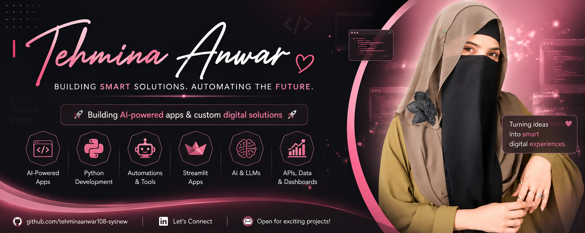

<div align="center">



<br><br>

# 👋 Hey, I'm **Tehmina**

### 🤖 AI Developer · 🐍 Python · ⚙️ Automation

**I build smart applications, automate ideas, and turn concepts into reality.** ✨

<br>


</div>

---

## 🌸 About Me

I'm **Tehmina**, a Python & AI enthusiast focused on building things that are:

> **Smart 💡 · Useful ⚡ · Creative 🎨 · Automated ⚙️**

I enjoy experimenting with AI, developing Python applications, and turning everyday ideas into digital solutions.

---

## 🧠 What I Work With

<div align="center">

|       🤖 AI      |   🐍 Python  | ⚙️ Automation |
| :--------------: | :----------: | :-----------: |
| Machine Learning | Applications |   Workflows   |
|   Generative AI  | Data & Logic |  Smart Tools  |
|       LLMs       |     APIs     |  Productivity |

</div>

---

## ✨ Currently Exploring

```text
Artificial Intelligence     ████████████████░░░░
Generative AI               ██████████████░░░░░░
Python Development          █████████████████░░░
Automation                  ███████████████░░░░░
LLMs & RAG                  ████████████░░░░░░░░
```

---

## 🚀 My Creative Space

💡 **Ideas** → 🐍 **Python** → 🤖 **AI** → ⚙️ **Automation** → ✨ **Reality**

I believe the best projects start with a simple idea.

So I'm here to **learn, build, experiment and create.** 🌱

---

<div align="center">

### 🌷 Thanks for stopping by!

**Explore • Learn • Build • Automate**

<br>

`💜 One idea at a time.`

<br><br>

✨ **More projects & experiments coming soon...** 🚀

</div>
